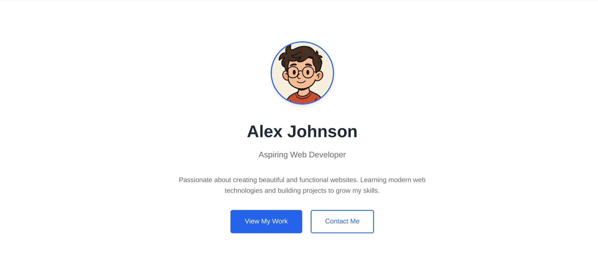
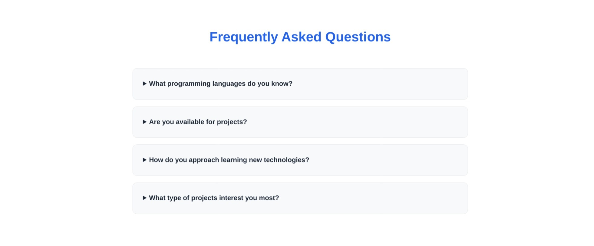
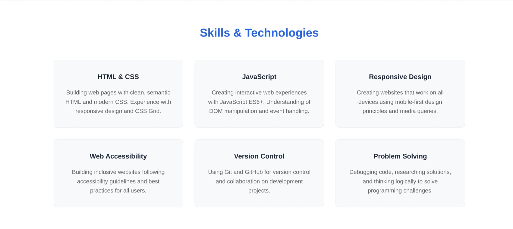
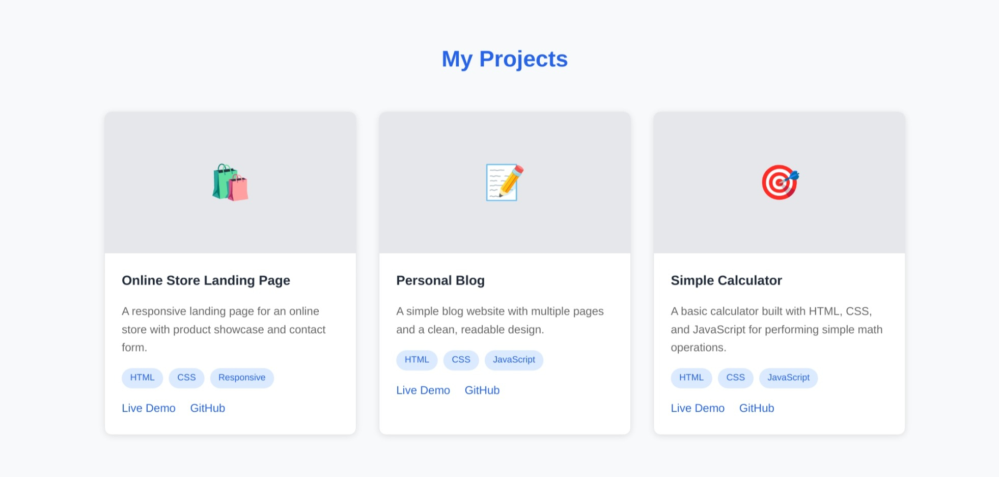
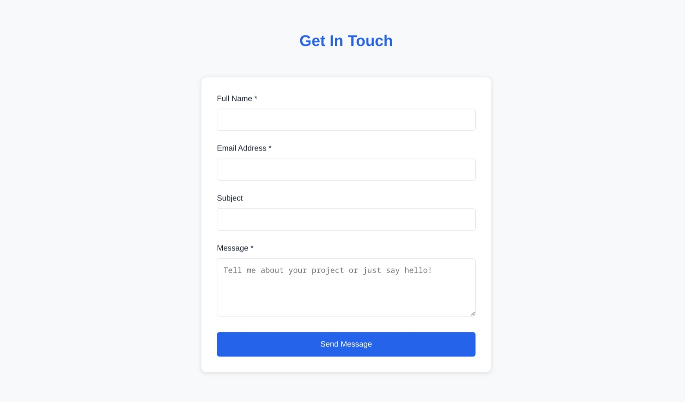
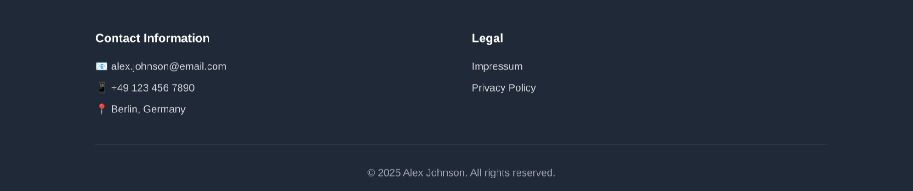

# Your First Web Development Project: Personal Portfolio

## What You'll Build

Welcome to your web development journey! Throughout this course, you'll be building a personal portfolio website that showcases your skills, projects, and personality to potential employers and clients.

### 🎯 Your Portfolio Project

By the end of this course, you'll have created a professional portfolio website with several projects that you can proudly share with the world!

### Visual Examples

**Final Result: Your Professional Portfolio**

*A fully styled, responsive portfolio with modern design, interactive elements, and professional presentation.*

**Starting Point: HTML Structure**

*We'll start with the basic HTML structure and progressively enhance it with CSS styling and interactivity.*

### 🚀 Why Build a Portfolio?

A portfolio website is essential for any web developer. It's your digital business card, showcasing your skills and helping you land your first (or next) web development job. Plus, building it teaches you all the fundamentals of web development!

## Portfolio Features You'll Create

Your portfolio will include all the essential sections that employers and clients look for:

### 📋 Portfolio Sections

- **Header & Navigation**: Professional site navigation with smooth scrolling
- **Hero**: First impression with professional photo (or avatar)
- **About Me**: Personal introduction
- **Skills**: Visual representation of your technical abilities
- **Projects**: Showcase of your work with descriptions and 
- **FAQ**: Section with Frequently Asked Questions (optional)
- **Contact**: Professional contact form and social media links
- **Footer**: Copyright, contact information and legal links

#### Header with Navigation:

#### Hero Section
Can be also included in the header based on preferences.

#### About Me Section

#### Skills Section

#### Projects Section

#### FAQ Section

#### Contact Section

#### Footer Section

### 🛠️ Development Skills

- **Semantic HTML**: Proper document structure and accessibility
- **Modern CSS**: Flexbox, Grid, responsive design, and animations
- **Responsive Design**: Works perfectly on mobile, tablet, and desktop
- **Git & GitHub**: Version control and hosting your live website
- **Web Performance**: Fast loading and optimized images
- **SEO Basics**: Making your site discoverable by search engines

## Your Learning Journey

We'll build your portfolio step-by-step, learning new concepts and immediately applying them to your project. This hands-on approach ensures you understand not just the theory, but how to implement real-world solutions.

### Learning Approach

#### 📚 Learn by Doing

First, you'll work through guided tutorials to learn the fundamentals. Then, you'll immediately apply those skills to build your own portfolio. This combination of guided learning and practical application is the fastest way to master web development!

### 🎯 Week 1 Focus: HTML & CSS Foundations

- **Learn HTML Basics**: Complete FreeCodeCamp's Cat Photo App tutorial
- **Apply to Portfolio**: Build your portfolio's HTML structure
- **Learn CSS Styling**: Make your portfolio beautiful and responsive
- **Deploy Online**: Share your portfolio with the world using GitHub Pages

### 🎉 Ready to Start?

Your journey to becoming a web developer starts now! In Week 1, you'll set up your development environment and begin building your portfolio. By the end of the week, you'll have a functional website online that you can share with friends and family.

---

**Next Step**: [Week 1: Development Environment Setup & HTML/CSS Foundations](0_introduction.md)